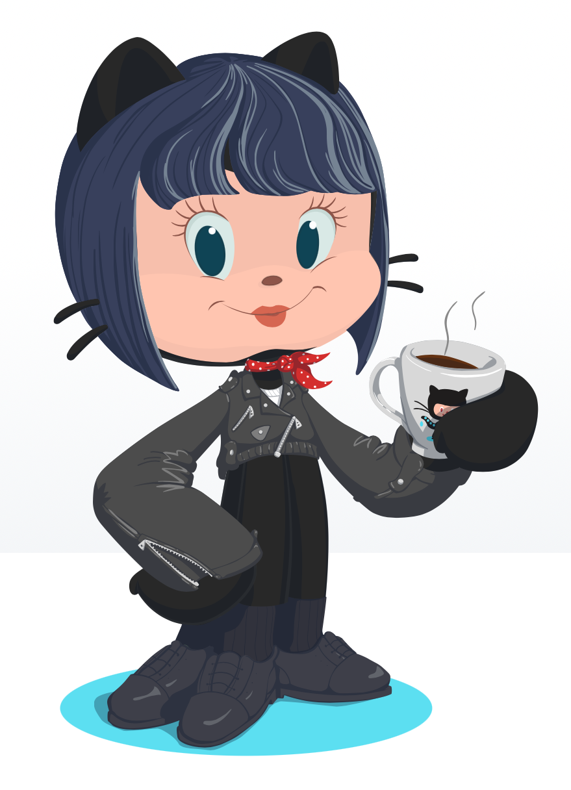

# Let me tell you a little bit about Me
I've been a coffee junky since I was a child, having the 3pm coffee with my Yaya, I'm also a coffee snob and I'm from the country that makest he best coffee in the world (figure that one out). 

#My Career
I'm currently a social media manager, and while I love the creativity aspects of marketing, I'm currently moving to data analytics. I've donde data analysis in marketing, to make data driven decisions, but now I'm getting my hands dirty with SQL and Tableau.

#My Hobbies
Besides from trying out the new coffee place in town, and still sticking to my favorites. I also love books, music (post-punk, goth, industrial, etc.) and platforms. 

#Top 5 Books
Interview with the Vampire, Pandora, Harry Potter Series, The Little Prince, and The Humans.
